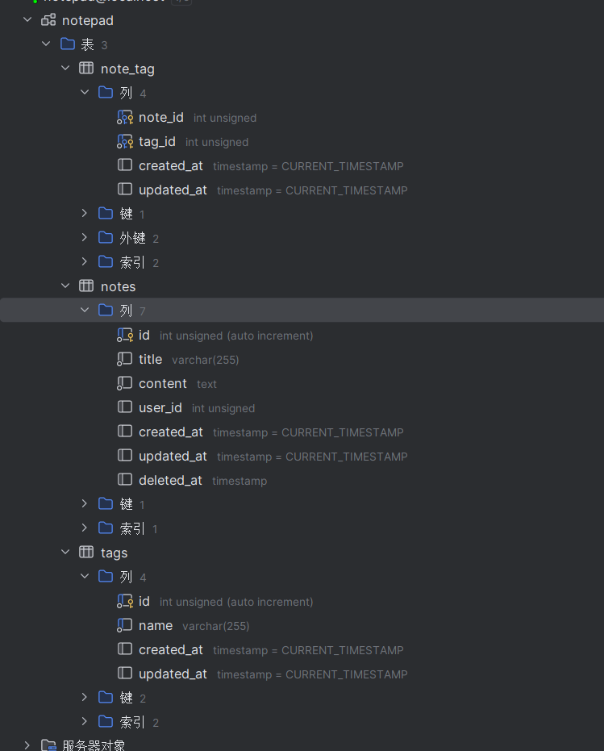

# 任务

1. 写一篇文档给室友介绍如何安装 PHP/Laravel 本地开发环境
2. 在自己的电脑上运行一个空白的 Laravel 项目
3. 用 Laravel 实现一个记事本，并推送到自己的 github 仓库中
    a. 记录包含标题和内容
    b. 可以给单条记录添加 tag (使用 Laravel 提供的 Relation 功能实现)
    c. 可以恢复被删除的记录 (使用软删除)
    d. 支持复制单条记录，被复制的记录标题需要按照以下规则修改：
       - 如果被复制的记录标题是 "Title", 如果数据库中不存在标题为 "Title(1)" 的记录，复制后的记录标题是 "Title(1)"
       - 如果被复制的记录标题是 "Title", 但是数据库中已经存在标题为 "Title(1)" 的记录，复制后的记录标题是 "Title(2)"
       - 如果被复制的记录标题是 "Title(1)", 复制后的记录标题是 "Title(2)"
       ...
       - 如果被复制的记录标题是 "Title(99)", 复制后的记录标题是 "Title(99)(1)" 
       - 如果被复制的记录标题是 "Title(99)(99)", 复制后的记录标题是 "Title(99)(99)(1)" , 以此类推
       
4. 给记事本项目加上单元和功能测试，并实现 github action 持续集成

文档直接写在项目 readme 中即可。

这些任务的考察点：
1. 学习能力：能否快速学习新语言、新框架
2. 文档能力：能否写出容易让人读懂的文档，a. 结构化 b. 从读者的角度出发
3. 代码质量：代码风格、变量命名、commit message、代码可读性

# 需求分析&&计划
大致归纳为以下几个步骤：
1、配环境+写一个文档记录。

2、用Laravel去成功“hello world”

3、实现记事本：
初步想法是本地IO流来控制，或连接数据库 进行实现。但通过提示“使用 Laravel 提供的 Relation 功能实现”，搜索得知Relation是一个ORM库，所以应该是需要连接数据库实现的。

ab需求应该是对应的数据库增改操作。c记录软删除，我的理解是使用一个`is_delete`字段标记，进行删除。d功能理解为复制，并且进行一系列判断，实现命名。

4、单元测试与功能测试。

5、用Github去CI。

# 项目设计

## 数据库设计
计划一共3个表，`notes`,`tags`,`note_tag`。分别存储笔记，所有的tag，tag和笔记的对应关系（多对多）。

目前建表情况如下：

先前规划时候，需要一个is_delete字段进行软删除。
但发现Laravel 的SoftDeletes 提供了软删除功能。原理大致是通过一个`delete_at`字段标识删除时间。和现在时间比较判断是否删除。所以修改了此处设计。

## 架构设计
计划是MVC，分Controller, Repository, Service, Model, View。

Model中主要有Note和Tag，并且定义他们之间彼此的关系。

View相当于搞一个简单的前端？（前端很菜，仅加个按钮）
对接前端的话需要加一个Router去写。

Controllers是请求的处理。

Service那就是逻辑部分，去写那些CURD的调用，复制的判断等等。。

Repository就是数据库请求的处理，和Model去对。

依据Laravel新建的demo中给到的分层，Model、Controllers、Repository、Service都主要是放在app下。View在resources下。public放一个`index.php`作为入口。