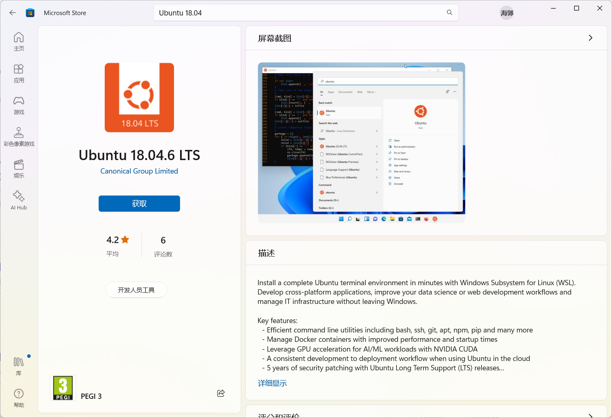

# 前言
因为一个小项目，所以需要接触到一下PHP+Laravel，因此将环境配置过程进行记录。

# 编译器安装
参考[网络资源](https://www.wbolt.com/php-editor.html)，PHP的编译器有很多种可供选择。由于笔者个人先前所用的是Jet系列居多，用起来较为顺手。因此本次采用的依旧是Jet家的编译器——PHPStorm。本文所记录的也是此编译器环境配置。

## 下载
去[官网](https://www.jetbrains.com/zh-cn/phpstorm/download/#section=windows)进行下载即可。有免费30天试用，学生可免费试用，或通过[开发者认证](https://www.jetbrains.com/zh-cn/community/dev-recognition/)也可白嫖。再或其他方法，掏钱或自行搜索魔法。


## 安装
打开后一直“下一步”即可。
注意安装路径，最好还是不要带中文，虽然或许大多数时候没事，但就是那些小部分的莫名其妙会让你焦头烂额。


安装结束后重启电脑即可。


# PHP安装
网络搜索`PHP安装`，会得到许多种的安装方式。本文参考的是[Laravel学院](https://laravelacademy.org/post/21709)推荐的一种安装方式进行安装——即使用WSL虚拟机作为运行环境，使用PHPStorm进行编码开发。

## 通过 WSL 搭建 PHP 本地开发环境
本方案参考自:https://laravelacademy.org/post/21703

### 安装WSL
电脑中已经安装过，因此不便卸载重装。具体教程可以参考[官方文档](https://learn.microsoft.com/en-us/windows/wsl/install)或其他网络资料。

关于WSL的简介可以参考[官方介绍](https://learn.microsoft.com/zh-tw/windows/wsl/about)或其他资源
### 安装ubuntu
在Microsoft Store搜索Ubuntu 18.04安装即可。

安装后启动即可。


需要你手动设置一下账户密码，成功后如下：


### 安装PHP

通过下述命令安装：
```
sudo apt install php php-mbstring php-dom php-xml php-zip php-curl php-xdebug
```

在安装前，先通过下述命令替换阿里源，加快下载速度。

```
sudo apt update
sudo apt upgrade
```

安装过程中需要输入一次Y/N。安装成功后如下：


输入`php --version`验证安装是否成功。


### 安装其他组件

Composer安装(踩坑！！)：
Composer可大致理解为一个包管理工具，类似于Golang的go mod，js 的npm。
[具体介绍如下](https://zh.wikipedia.org/zh-cn/Composer_(%E8%BB%9F%E9%AB%94))
```
sudo apt install composer
```
update：别用上面那个方法！！那玩意安下来是1.0版本的， 老旧版本，很多功能用不了！！！
```
sudo wget https://rdc-public-software.oss-cn-hangzhou.aliyuncs.com/composer/2.1.5/composer.phar -O /usr/local/bin/composer
```
用这个指令去安装，安下来是2.15。之后自带的更新就行了。(今天24.3.16，用的是2.72版本)


Git的安装：
执行即可，不再阐述
```
sudo apt install git
```


## 宿主机与虚拟机的通信
### WSL访问宿主机
Windows 主机的文件系统是挂载在 Ubuntu 虚拟机的 /mnt 目录下的，因此通过`cd /mnt/`，之后ls 即可发现，这里就相当于“我的电脑”目录，然后操作即可。


### PHPStorm访问虚拟机
因为我们最终所需实现的目的是：“Windows开发，wsl运行”。所以我们需要做一个“绑定”，否则你两个地方环境还是分开的。
#### 配置（此处极易踩坑）
首先新建一个项目，之后进入设置，如图进行配置 一路ok即可。


再为我们的composer进行一些配置。


为Test Frameworks（就是测试框架，比如Go test）进行配置


去WSL中启用PHP Xdebug 扩展
修改配置文件：记得sudo
```
sudo vim /etc/php/7.2/cli/conf.d/20-xdebug.ini
```

替换为
```
zend_extension=xdebug.so
xdebug.remote_enable=1
xdebug.remote_host=localhost
xdebug.remote_port=9988
xdebug.remote_autostart=1
xdebug.profiler_enable=1
xdebug.profiler_output_dir="/tmp"
xdebug.idekey=PHPSTORM
```

#### 测试
本地创建一个文件，输出`phpinfo()`，启动`php -S localhost:9999`，注意端口和上述配置文件的那个不一样！！！后续配IDE的时候用到的是现在这个！！！

之后进入localhost对应端口查看即可。这样即说明debug开启成功。
（截图中port不一致请忽略）


#### 基于远程 PHP Xdebug 进行代码调试

新建远程配置（这个地方是运行的那个port）


设置（这里是配置文件的那个port）


其实这里理解了就很好明白，一共涉及到的port有两个，一个是运行服务器的port，另一个是监听Xdebug的。后者的话需要双向配置，WSL和Windows都监听到这个就OK了。


# Laravel 安装
直接官方文档有
```
composer global require laravel/installer

```
记得配一下环境变量（官方文档没写居然。。。）
```
 vim ~/.bashrc
 ```
 末尾添加
 ```
 export PATH="$PATH:$HOME/.config/composer/vendor/bin"
```

完毕后记得重启
```
source ~/.bashrc
```


通过`laravel new example-app`创建需要Php 7.3以上，我是7.2，所以得通过
```
 composer create-project --prefer-dist laravel/laravel example-app
```
创建。
创建成功后如图：

运行：

成功“Hello World”！


# 结语
本次成功安装了PHP的环境，选取的方案是Windows本地PhpStorm进行编码+WSL中的PHP环境进行调试运行，这种方案综合来看较优。

并且安装了Laravel框架，成功创建一个示例项目进行了Hello World。

所遇到错误大致有两处：版本原因、XDebug的远程连接。均已在文中进行了易错点标注，还请多多小心。

如果有任何问题，欢迎通过邮箱与我联系：
>Z2NsaW1iZXI0N0BnbWFpbC5jb20=